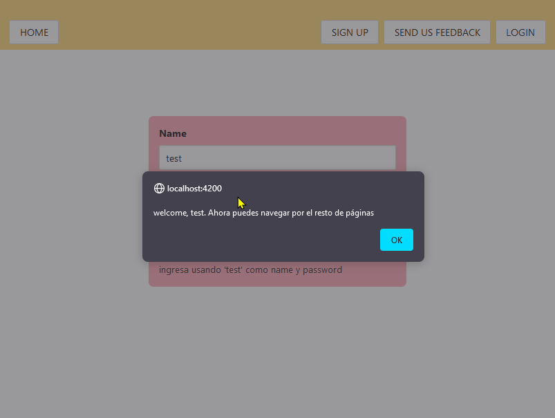
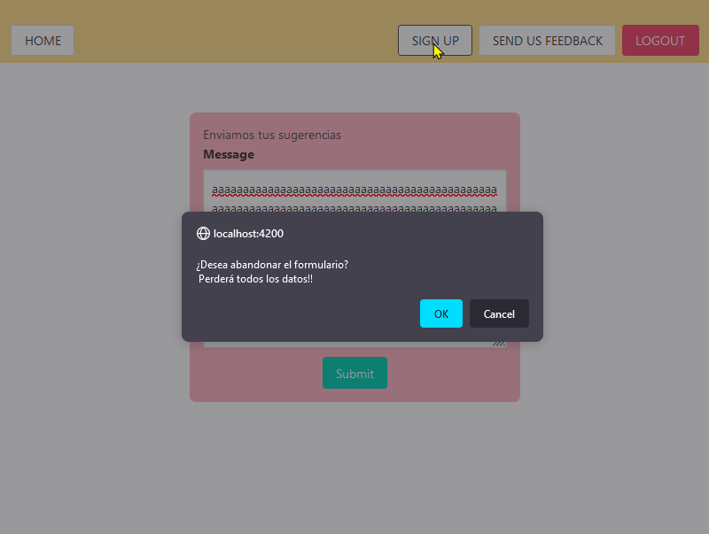
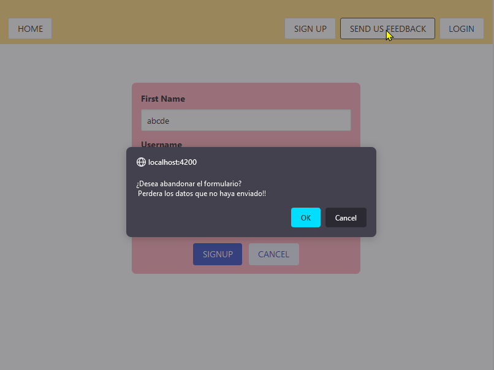

# Act22

Interfaz login que permite el acceso con credenciales de prueba (username: test, password: test)

Auth Login
username:
pass:
btn login

●	La aplicación debe tener implementada la protección de rutas mediante la clase Auth Guards. Si el usuario no se ha logeado y quiere navegar  a otra página sin autorización, el sistema automáticamente  debe re direccionarlo a otra página que no sea la de profile (login o un home)

●	Si el usuario ingresa las credenciales correctas, la aplicación debe redireccionarlo a la página principal. 

La página profile debe mostrar los datos del usuario.
first name: Test
last name: User
email:. testuser@contoso.com

